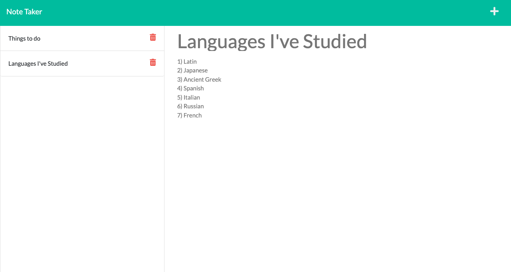

  # phelps-note-taker

  

  ## Description

  This application uses Express to allow users to create and save notes on a webpage. The notes that users create are saved on a server, and retrieved from that same server. Notes may be added and deleted by clicking on various buttons on the webpage, said buttons' functionality being clear based on their appearance as specific icons.

  ## Table of Contents

  - [Installation](#installation)
  - [Usage](#usage)
  - [Deployed Application](#deployed-application)
  - [Screenshot](#screenshot)
  - [Questions](#questions)

  

  ## Installation

  Make sure to initialize npm by running "npm init -y" in your terminal, and then install the needed packages by also running "npm i" in your terminal. Start the application by running "npm start" in your terminal.

  ## Usage

  If you would like to run the application from your own computer, after running "npm start" in your terminal, open "http://localhost:3001" in your browser. If you want to use the pre-existing server, go to https://intense-lake-30149.herokuapp.com/, then click the "Get Started" button to navigate to the page where you will be able to add notes. Click the "+" button to add a new note, type a title and some text, and then click the button that looks like a floppy disk to save the note. Click on an old note in the left-hand column to see that note. Click on the trash can icon next to a note's title in the left-hand column to delete that note.

## Deployed Application
Link: [Note Taker](https://intense-lake-30149.herokuapp.com/)

## Screenshot

  

## Questions

  - GitHub: [sora64](https://github.com/sora64/)

  - Email: If you have any other questions, please reach me at [phelpsa64@gmail.com](mailto:phelpsa64@gmail.com).
